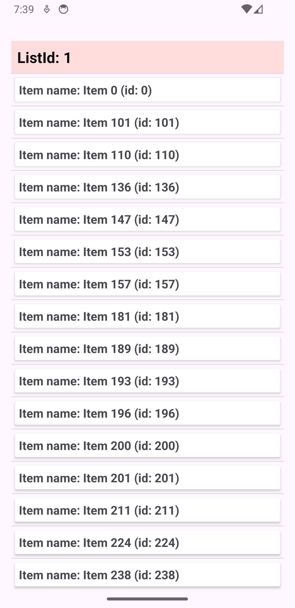
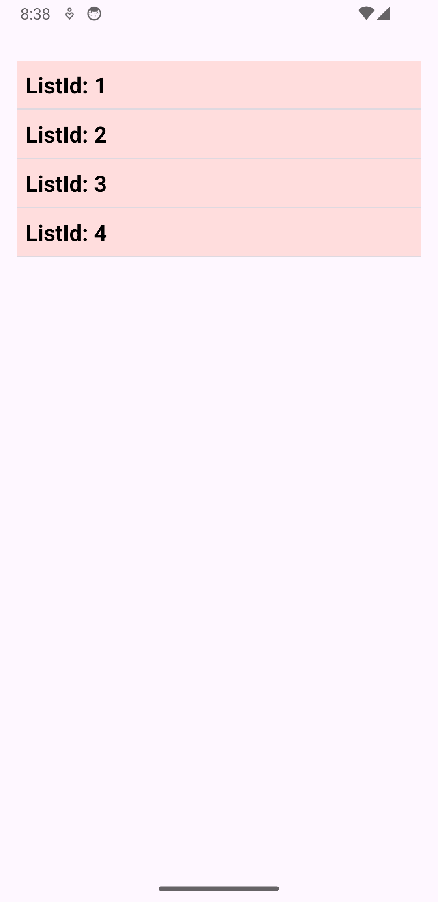

# About Project 

This project is a coding exercise designed to display a list of items with specific filtering and sorting functionality.

# Project Demo

## Screenshots

<p float="left">
  
  
</p>

# Item List Display

This project provides functionality to display a list of items grouped by `listId`, with filtering and sorting applied based on specific requirements.

## Features

- Group items by `listId`
- Sort items first by `listId`, then by `name`
- Filter out items where `name` is blank or null

## Installation

1. Clone the repository:
   ```bash
   git clone https://github.com/yourusername/projectname.git
