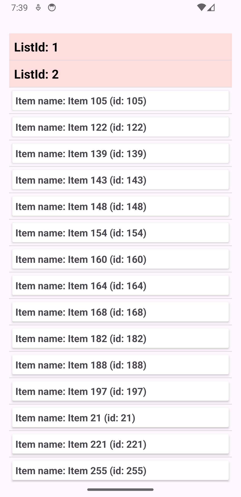

# About Project
This project is a coding exercise designed to display a list of items with specific filtering and sorting functionality.
It is developed using Kotlin and follows the MVVM architecture pattern for clean and maintainable code.

# Project Demo

## Screenshots

  
  
  

# Item List Display

This project provides functionality to display a list of items grouped by `listId`, with filtering and sorting applied based on specific requirements.

## Features

- Group items by `listId`
- Sort items first by `listId`, then by `name`
- Filter out items where `name` is blank or null

